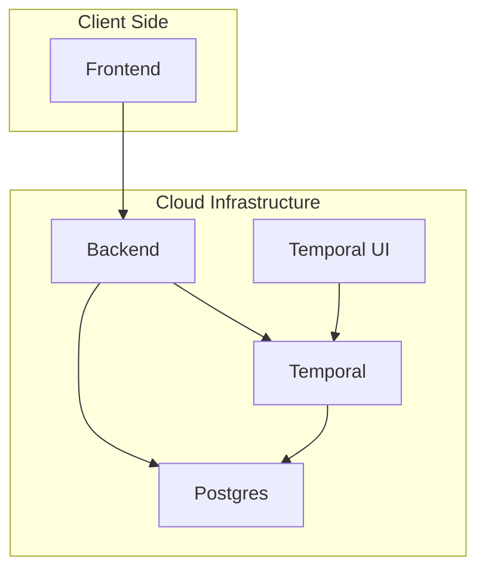

# Git-Repo-Organizer

## One-line Value Prop
A full-stack platform that analyzes and organizes Git repositories using a Python FastAPI backend, a Next.js frontend, PostgreSQL, and Temporal for long-running task orchestration.

## Architecture Overview


## Quick Start
```bash
# Clone the repository
git clone https://github.com/shrikanthv15/Git-Repo-Organizer.git
cd Git-Repo-Organizer

# Install dependencies (optional if using Docker)
poetry install

# Start the full stack with Docker Compose
docker-compose up --build
```

## Tech Stack
- Python
- FastAPI
- SQLAlchemy
- Alembic
- Temporal
- PostgreSQL
- Docker
- Docker Compose
- Next.js
- TypeScript
- React
- OpenAI / LLM API

## Features
- GitHub repository analysis powered by an LLM
- Temporal-based orchestrations for long-running tasks
- PostgreSQL persistence with Alembic migrations
- REST API with FastAPI to manage repositories and analyses
- Next.js frontend dashboard for repository insights

## Contributing
- CONTRIBUTING.md

## License
- TBD