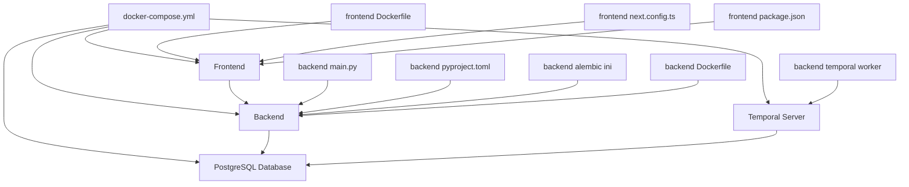

# Git Repo Organizer

A full‑stack platform to analyze and organize Git repositories with AI assistance. The backend is a FastAPI application backed by PostgreSQL, with Temporal for orchestration of long‑running tasks. The frontend is a Next.js application that provides a dashboard and repository pages. The project includes Docker Compose orchestration to run the backend, frontend, PostgreSQL, and Temporal server together.

---

## Architecture Overview

- Top level components: Backend, Frontend, Temporal Server, PostgreSQL Database
- Key config and entry points: backend/main.py, backend/pyproject.toml, backend/alembic.ini
- Docker artifacts: backend/Dockerfile and frontend/Dockerfile
- Frontend config: frontend/next.config.ts and frontend/package.json
- Orchestration: docker-compose.yml that wires all services together

---

## Tech Stack

- Languages
  - Python
  - TypeScript / JavaScript
- Backend
  - FastAPI
  - SQLAlchemy (ORM)
  - Alembic (migrations)
  - Pydantic
  - Temporal Python SDK (for workers and workflows)
- Frontend
  - Next.js (React) with TypeScript
- Databases / Storage
  - PostgreSQL (PostgreSQL 16 Alpine in Docker)
- Infrastructure / Tools
  - Docker
  - Docker Compose
  - PNPM (frontend package management)
- AI / Integrations
  - LLM integration (LLM service in backend)
  - GitHub related services (github_service.py, github.py)
- Project configuration
  - pyproject.toml (Python tooling)
  - pnpm-workspace.yaml and pnpm-lock.yaml (frontend workspace)
  - ESLint, PostCSS, and Next.js tooling (frontend)

---

## Getting Started / How to Run

The project is configured to run using Docker Compose. The docker-compose.yml file defines services for PostgreSQL, Temporal server, the backend (FastAPI), a Temporal worker, and the frontend (Next.js).

Prerequisites:

- Docker
- Docker Compose

Run the full stack:

- From the repository root:
  - docker-compose up --build

This will start:

- PostgreSQL database
- Temporal server
- Backend API (FastAPI) available at http://localhost:8000
- Temporal worker
- Frontend (Next.js) available at http://localhost:3000

Optional:

- To run just the backend and skip frontend:
  - docker-compose up --build backend
- To run only the Temporal worker separately:
  - docker-compose up --build worker
  - Or start it explicitly: docker-compose run --rm worker

Shut down:

- docker-compose down

Notes:

- The docker-compose.yml references a .env file for environment variables. If you need to customize credentials, you can provide them in a .env file or override via environment variables when starting the services.
- The PostgreSQL container uses default environment values in the compose (gardener / gardener_secret / gardener) unless overridden.

## Contributing

Contributions are welcome. To contribute:

- Fork the repository and create a feature branch.
- Write tests or add validation where applicable.
- Ensure code passes linting and type checks.
- Open a pull request with a concise description of the changes.

If you’re unsure how to start, look at:

- backend/ for API, data models, and Temporal workflows
- frontend/ for UI components and API integration
- docker-compose.yml for local development setup

---

If you’d like, I can tailor the README further with more details from the actual config files or add example environment variables for the .env file.
