# Git Repo Organizer

A full stack monorepo that orchestrates git repository analysis and organization using AI driven workflows. The backend is a Python FastAPI application with Temporal workflows and PostgreSQL, while the frontend is a Next.js (TypeScript) application. The project integrates with GitHub and AI services to analyze repositories and perform coordination through Temporal.

## Architecture Overview

```mermaid
graph TD
Root[Root Directory]
BackendBackend[Backend]
FrontendFrontend[Frontend]
ScriptsScripts[Scripts]
DocsDocs[Documentation]
DockerComposeFile[Docker Compose]

Root --> BackendBackend
Root --> FrontendFrontend
Root --> ScriptsScripts
Root --> DockerComposeFile
Root --> DocsDocs

BackendBackendMain[Backend Core Files]
BackendBackendDocker[Backend Dockerfile]
BackendBackendPyproj[Backend Pyproject Toml]
BackendAlembicDir[Alembic Directory]
BackendTemporalDir[Temporal Components]
BackendApiRoutes[Api Routes]
BackendModels[Database Models]
BackendSchemas[Schemas]
BackendServices[GitHub and LLM Services]
BackendTests[Tests and Utilities]

FrontendFrontendMain[Frontend Core Files]
FrontendFrontendDocker[Frontend Dockerfile]
FrontendPackageJson[Frontend Package Json]
FrontendNextConfig[Next Config]
FrontendPublic[Public Assets]
FrontendSrc[Frontend Source]

BackendBackend --> BackendBackendMain
BackendBackend --> BackendBackendDocker
BackendBackend --> BackendBackendPyproj
BackendBackend --> BackendAlembicDir
BackendBackend --> BackendTemporalDir
BackendBackend --> BackendApiRoutes
BackendBackend --> BackendModels
BackendBackend --> BackendSchemas
BackendBackend --> BackendServices
BackendBackend --> BackendTests

FrontendFrontendMain --> FrontendFrontendDocker
FrontendFrontendMain --> FrontendPackageJson
FrontendFrontendMain --> FrontendNextConfig
FrontendFrontendMain --> FrontendPublic
FrontendFrontendMain --> FrontendSrc
FrontendFrontendMain --> FrontendPublic

DockerComposeFile
```

## Tech Stack

- Languages
  - Python
  - TypeScript (Frontend)
  - SQL

- Backend Frameworks / Tools
  - FastAPI
  - SQLAlchemy
  - Alembic
  - Temporal
  - PostgreSQL
  - Uvicorn (likely via FastAPI deployment)

- Frontend Frameworks / Tools
  - Next.js
  - React
  - TypeScript
  - PNPM (workspace tooling)
  - PostCSS (config present)

- Infrastructure / DevOps
  - Docker
  - Docker Compose
  - Temporal UI
  - PostgreSQL (via Docker Compose)

- Integrations
  - GitHub API (github_service)
  - Large Language Model tooling (llm_service)

## Getting Started / How to Run

Prerequisites
- Docker and Docker Compose installed
- Optional but recommended: .env file for backend; contains PostgreSQL credentials if you want to customize defaults

What’s supported by this repo (per the config)
- The app is designed to be run via Docker Compose with multiple services: backend, frontend, postgres, Temporal, and Temporal UI
- Frontend is built with build args for Next.js; provide values for NEXT_PUBLIC_GITHUB_CLIENT_ID and NEXT_PUBLIC_API_BASE_URL during build if you customize
- Backend relies on a Postgres database; a persistent volume is defined

Quick Start
1) From the repo root, start the full stack
- Command:
  docker compose up --build

2) Access the services
- Backend API: http://localhost:8000
- Temporal UI: http://localhost:8233
- Frontend: http://localhost:3000

3) Stop the stack
- Command:
  docker compose down

Optional: Run individual services (if you want to start only certain parts)
- Start only backend and its dependencies (postgres, temporal)
  docker compose up --build backend postgres temporal

Environment notes
- The docker-compose.yml uses an env_file (.env) for some services; you can provide credentials there. If not provided, defaults defined in the compose file will be used (for example Postgres user gardener and a gardener_secret password).
- Backend and worker are configured to connect to the Postgres service using DATABASE_URL syntax. Temporal is wired to connect as well.
- The frontend build uses build args NEXT_PUBLIC_GITHUB_CLIENT_ID and NEXT_PUBLIC_API_BASE_URL; you can supply these values when building the frontend image via the docker-compose build phase or by providing a .env and extending the compose file accordingly.

File references you might customize
- backend/.env (via docker-compose env_file) for Postgres credentials
- frontend build args for NEXT_PUBLIC_GITHUB_CLIENT_ID and NEXT_PUBLIC_API_BASE_URL

Note: The repository includes a docker-compose.yml at the root which ties together postgres, temporal, temporal-ui, backend, worker, and frontend services. The architecture diagram and deployment steps above align with those services.

## Project Structure

- backend/
  - alembic/ (database migrations)
    - versions/001_initial.py
  - anti-gravity did this/ (documentation)
    - testing_guide.md
  - app/
    - api/ (routes and API)
    - core/ (config and core utilities)
    - db/ (crud, models, session)
    - schemas/ (data models for analysis and github)
    - services/ (github_service, llm_service)
    - temporal/ (activities, worker, workflows)
    - __init__.py
    - main.py
  - alembic.ini
  - Dockerfile
  - main.py
  - pyproject.toml
  - README.md
  - uv.lock
- frontend/
  - public/ (static assets)
  - src/
    - app/ (callback, dashboard, login, repo pages)
    - favicon.ico
    - globals.css
    - layout.tsx
    - page.tsx
    - components/ (providers)
    - hooks/ (use-gardener)
    - lib/ (utils)
    - services/ (api)
    - types/ (api)
  - Dockerfile
  - eslint.config.mjs
  - next.config.ts
  - package.json
  - pnpm-lock.yaml
  - pnpm-workspace.yaml
  - postcss.config.mjs
  - README.md
  - tsconfig.json
- scripts/
  - system_check.py
- ROOT
  - BACKEND_ARCHITECTURE.md
  - FRONTEND_ARCHITECTURE.md
  - prompt_phase10_final_fix.md
  - README.md
  - docker-compose.yml

Key notes
- The backend houses a FastAPI app with Alembic migrations and Temporal integration for asynchronous workflows.
- The frontend is a Next.js TypeScript application with a structured pages and components layout.
- Temporal components (activities, worker, workflows) coordinate long-running tasks like repository analysis and GitHub interactions.

## Contributing

Contributions are welcome. Please follow these guidelines:

- Fork the repository and create a feature branch
- Ensure code is properly formatted and documented
- Add tests or update existing tests where applicable
- Run the project locally with Docker Compose to verify changes
- Open a Pull Request with a clear description of the change and its impact

Development and contribution guidelines
- Ensure you run docker compose up --build to test changes in an environment that mirrors production
- If you modify backend APIs, update or add tests under the backend tests structure
- If you modify frontend components, update or add relevant UI tests and verify TypeScript types
- Document any new environment variables or configuration needs in the README

Enjoy building and extending the Git Repo Organizer!