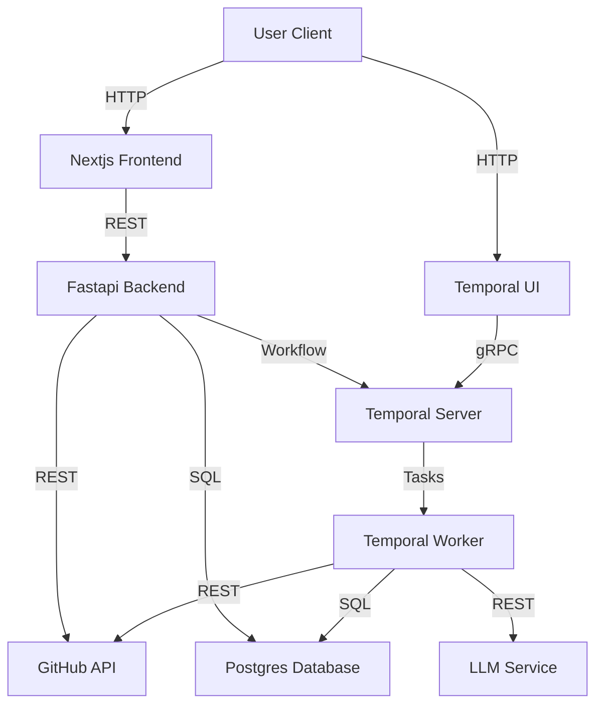

# Git-Repo-Organizer
*Analyze, organize, and continuously “garden” GitHub repositories with a workflow-driven backend and a polished Next.js dashboard.*


## Overview
Git-Repo-Organizer is a full-stack app that connects to GitHub, pulls repository metadata, and turns it into actionable organization and analysis inside a dashboard UI. The frontend is built with **Next.js App Router** (TypeScript + React) and communicates with a **FastAPI** backend that persists data in **PostgreSQL** via **SQLAlchemy** with **Alembic** migrations. Long-running ingestion/analysis is orchestrated using **Temporal** (server + worker), and the backend includes an `llm_service` used for LLM-assisted analysis and draft proposal generation stored in the database.

## System Architecture

```mermaid
graph TD
  User[User Client]
  Frontend[Nextjs Frontend]
  Backend[Fastapi Backend]
  Github[GitHub API]
  Temporal[Temporal Server]
  Worker[Temporal Worker]
  DB[Postgres Database]
  LLM[LLM Service]
  TemporalUI[Temporal UI]

  User -->|HTTP| Frontend
  Frontend -->|REST| Backend
  Backend -->|REST| Github
  Backend -->|SQL| DB
  Backend -->|Workflow| Temporal
  Temporal -->|Tasks| Worker
  Worker -->|SQL| DB
  Worker -->|REST| Github
  Worker -->|REST| LLM
  User -->|HTTP| TemporalUI
  TemporalUI -->|gRPC| Temporal
```

## Tech Stack
| Category | Technologies |
|----------|-------------|
| Backend  |    |
| Frontend |     |
| Database |  |
| Testing  |  |
| Infra    |  |

## Quick Start
Prereqs: **Docker + Docker Compose** (the repo ships a full local stack: Postgres, Temporal, FastAPI API, Temporal worker, Next.js UI).

```bash
git clone https://github.com/shrikanthv15/Git-Repo-Organizer.git
cd Git-Repo-Organizer

# Provide required env vars used by docker-compose (GitHub OAuth + API base URL)
# (docker-compose.yml also reads .env for backend/worker)
cp .env.example .env 2>/dev/null || true

docker compose up --build
```

## Key Features
- **Workflow-orchestrated background processing**: repository ingestion/analysis runs via **Temporal workflows + activities** with focused, single-responsibility activity modules for reliability and retry semantics.
- **Modular backend architecture**: Activities split by concern (`analysis`, `github`, `generation`, `persistence`, `portfolio`); routes split by resource (`health`, `auth`, `repos`, `garden`, `portfolio`). Each module ≤250 LOC, easier to review and extend.
- **First-class persistence with migrations**: **PostgreSQL** storage with **SQLAlchemy models** and **Alembic** versioned migrations (e.g., initial schema + draft proposal + status and last run tracking).
- **GitHub OAuth and repository UX**: Next.js routes for auth callback (`/callback`), dashboard (`/dashboard`), and per-repo drill-down (`/repo/[repoId]`) powered by a typed API client (`frontend/src/services/api.ts`).
- **LLM-assisted outputs**: backend `llm_service` supports generating structured analyses and **draft proposals** that are persisted and shown in the UI.
- **Batteries-included local stack**: `docker-compose.yml` brings up **Postgres**, **Temporal Server**, **Temporal UI** (localhost:8233), **FastAPI** (localhost:8000), **Worker**, and **Next.js** (localhost:3000) with sane defaults and health-checked dependencies.

## Backend Architecture

### Temporal Activities
Activities are the units of work in Temporal workflows. They are organized by concern into focused modules, each handling a specific domain:

```
backend/app/temporal/
├── __init__.py              # Re-exports all activity names for backward compatibility
├── workflows.py             # Temporal workflow definitions
├── worker.py                # Temporal worker boot
└── activities/
    ├── __init__.py
    ├── analysis.py          # Repo health analysis, activity scanning (Phases 4, 5, 9)
    ├── github.py            # PR/repo operations, repo listing (Phases 5, 6, 17, 19)
    ├── generation.py        # README, documentation generation (Phases 6, 12, 13, 19)
    ├── persistence.py       # Database writes, status updates (Phases 2, 13, 18)
    └── portfolio.py         # Portfolio analysis and profile operations (Phase 19)
```

**Key design:**
- All activities exported through `backend/app/temporal/activities/__init__.py`
- Existing imports (`from app.temporal.activities import analyze_repo_health`) continue to work
- Each module ≤300 LOC; single responsibility
- Helper functions grouped with activities that use them

### FastAPI Routes
Routes are split by HTTP resource/concern, not mixed in a monolith:

```
backend/app/api/
├── deps.py                  # Shared dependencies (get_temporal_client, get_current_token)
├── routes/
│   ├── __init__.py          # Aggregates all routers into api_router
│   ├── health.py            # /health endpoint
│   ├── auth.py              # /auth/exchange endpoint
│   ├── repos.py             # /repos, /analyze, /fix, /sync, /commit endpoints
│   ├── garden.py            # /garden/start, /garden/status endpoints
│   └── portfolio.py         # /portfolio/generate, /portfolio/status, /portfolio/publish endpoints
```

**Key design:**
- Shared logic extracted to `deps.py`
- Each route module handles one logical concern
- Routes import from `deps.py` to access `get_temporal_client()`, `get_current_token()`
- `app/main.py` includes `api_router` which aggregates all sub-routers

### Testing
Tests are colocated with modules and cover both activities and routes:

```
tests/
├── api/
│   ├── __init__.py          # Shared test fixtures (mock client, etc.)
│   └── test_routes.py       # Tests for all route handlers
└── temporal/
    ├── activities/
    │   ├── __init__.py      # Activity test fixtures
    │   ├── test_analysis.py
    │   └── test_generation.py
    └── __init__.py
```

Run tests with `pytest` (configured in `pytest.ini`):
```bash
pytest                  # Run all tests
pytest --cov          # Include coverage report
pytest tests/temporal  # Test specific subsystem
```