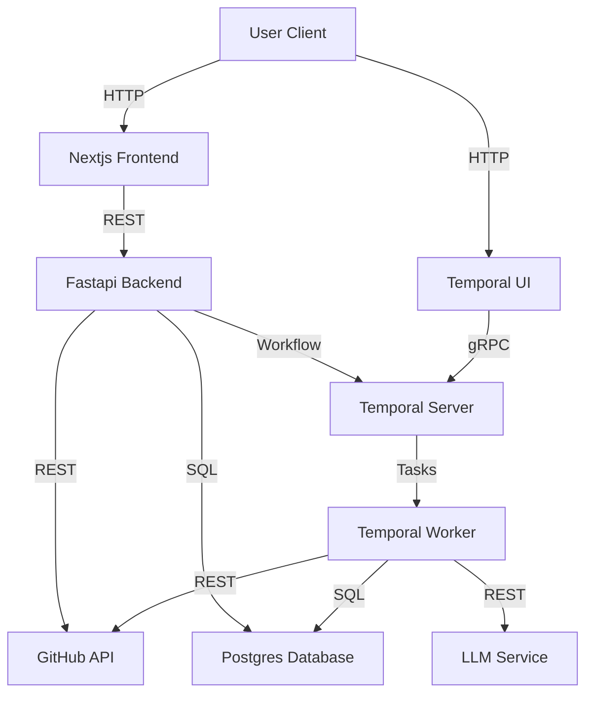

# Git-Repo-Organizer
*Analyze, organize, and continuously “garden” GitHub repositories with a workflow-driven backend and a polished Next.js dashboard.*


## Overview
Git-Repo-Organizer is a full-stack app that connects to GitHub, pulls repository metadata, and turns it into actionable organization and analysis inside a dashboard UI. The frontend is built with **Next.js App Router** (TypeScript + React) and communicates with a **FastAPI** backend that persists data in **PostgreSQL** via **SQLAlchemy** with **Alembic** migrations. Long-running ingestion/analysis is orchestrated using **Temporal** (server + worker), and the backend includes an `llm_service` used for LLM-assisted analysis and draft proposal generation stored in the database.

## System Architecture

```mermaid
graph TD
  User[User Client]
  Frontend[Nextjs Frontend]
  Backend[Fastapi Backend]
  Github[GitHub API]
  Temporal[Temporal Server]
  Worker[Temporal Worker]
  DB[Postgres Database]
  LLM[LLM Service]
  TemporalUI[Temporal UI]

  User -->|HTTP| Frontend
  Frontend -->|REST| Backend
  Backend -->|REST| Github
  Backend -->|SQL| DB
  Backend -->|Workflow| Temporal
  Temporal -->|Tasks| Worker
  Worker -->|SQL| DB
  Worker -->|REST| Github
  Worker -->|REST| LLM
  User -->|HTTP| TemporalUI
  TemporalUI -->|gRPC| Temporal
```

## Tech Stack
| Category | Technologies |
|----------|-------------|
| Backend  |   |
| Frontend |     |
| Database |  |
| Infra    |  |

## Quick Start
Prereqs: **Docker + Docker Compose** (the repo ships a full local stack: Postgres, Temporal, FastAPI API, Temporal worker, Next.js UI).

```bash
git clone https://github.com/shrikanthv15/Git-Repo-Organizer.git
cd Git-Repo-Organizer

# Provide required env vars used by docker-compose (GitHub OAuth + API base URL)
# (docker-compose.yml also reads .env for backend/worker)
cp .env.example .env 2>/dev/null || true

docker compose up --build
```

## Key Features
- **Workflow-orchestrated background processing**: repository ingestion/analysis runs via **Temporal workflows + activities** (`backend/app/temporal/{workflows,activities,worker}.py`) for reliability and retry semantics.
- **First-class persistence with migrations**: **PostgreSQL** storage with **SQLAlchemy models** and **Alembic** versioned migrations (e.g., initial schema + draft proposal + status and last run tracking).
- **GitHub OAuth and repository UX**: Next.js routes for auth callback (`/callback`), dashboard (`/dashboard`), and per-repo drill-down (`/repo/[repoId]`) powered by a typed API client (`frontend/src/services/api.ts`).
- **LLM-assisted outputs**: backend `llm_service` supports generating structured analyses and **draft proposals** that are persisted and shown in the UI.
- **Batteries-included local stack**: `docker-compose.yml` brings up **Postgres**, **Temporal Server**, **Temporal UI** (localhost:8233), **FastAPI** (localhost:8000), **Worker**, and **Next.js** (localhost:3000) with sane defaults and health-checked dependencies.